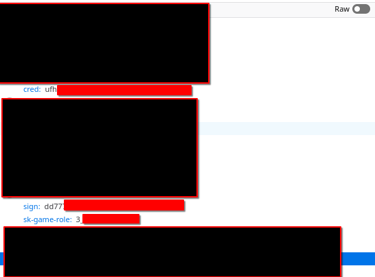
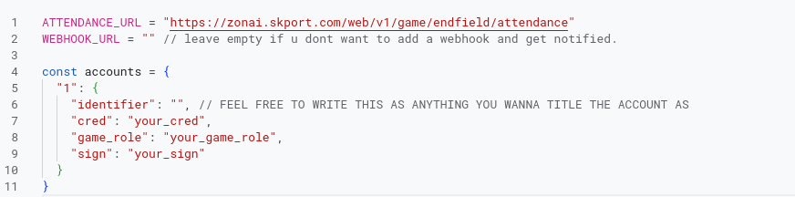

# skport_auto_checkin
utility for arknights endfield, auto checks in for the daily rewards.

Go to the checkin page at : https://game.skport.com/endfield/sign-in?header=0&hg_media=launcher&hg_link_campaign=banner

Open Inspect Element and go to the Network tab
Refresh the page while the inspect element console is opened in the network tab
There, search for a GET request (retcode 200) named "attendance" sent to "zonai.skport.com"

Once you click it, you need to check in "Request Headers" for these 3 things:
*cred
*sign
*sk-game-role

what you want to do is copy paste each of those 3 into the script as such

If you need to use a discord webhook just feel free to fill the webhook_url variable with your link.

then use it as a new project in Google Apps Script.
To AUTOMATE this task, use the time-based triggers google apps script provides.
